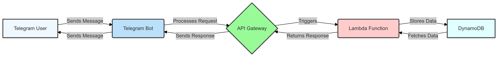

# Serverless Telegram Shopping List Bot

A serverless Telegram bot built on AWS that helps manage shared shopping lists. This project serves as a practical exploration of serverless architecture and AWS services.

## 🎯 Project Overview

This bot allows users to manage shopping lists through Telegram with features like:
- Creating and managing shopping lists
- Adding/Removing items
- Sharing lists with other Telegram users
- Managing user permissions
- Real-time updates and synchronization

## 🏗️ Architecture

The project uses a serverless architecture leveraging several AWS services:

- **AWS Lambda** - Handles bot commands and business logic
- **Amazon DynamoDB** - Stores shopping lists and user data
- **Amazon API Gateway** - Manages webhook endpoints for Telegram
- **Telegram Bot API** - User interface and interaction



## 🛠️ Prerequisites

- Python 3.10+
- AWS Account with appropriate permissions
- Terraform installed (v1.0.0+)
- Telegram Bot Token (obtained from [@BotFather](https://t.me/botfather))
- AWS CLI configured with appropriate credentials

## 📦 Required Python Packages

```txt
python-telegram-bot>=20.0
boto3>=1.28.0
python-dotenv>=1.0.0
aws-lambda-powertools>=2.15.0
requests>=2.31.0